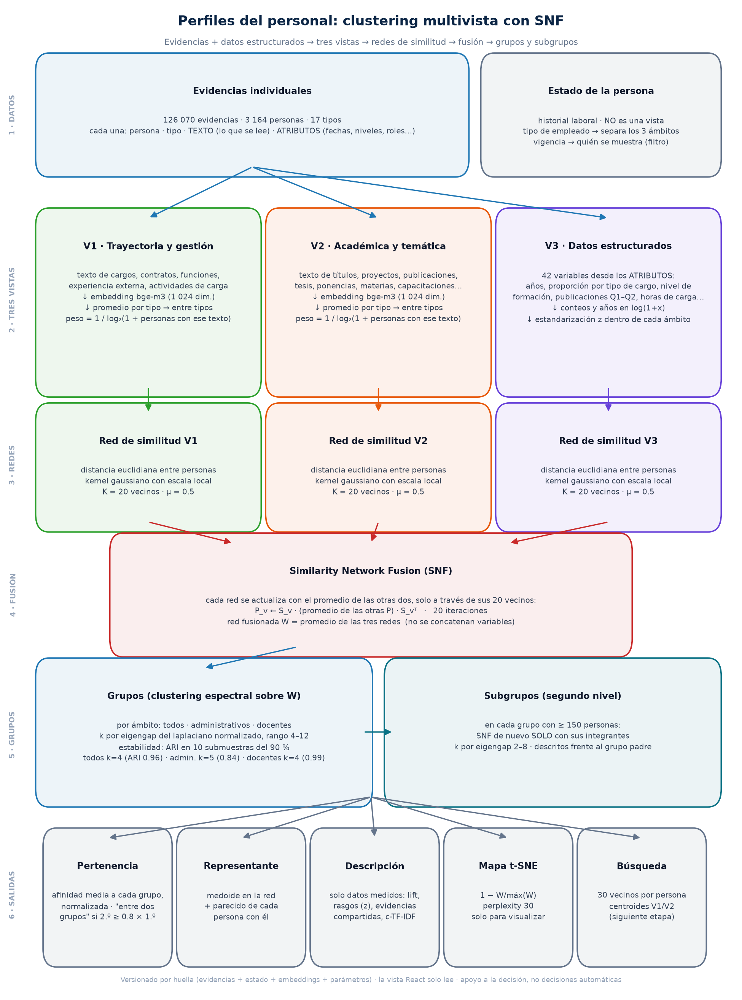

# Cómo se conectan las evidencias con los datos estructurados

**Clustering multivista del personal con Similarity Network Fusion (SNF)**

> Versión documentada: `20261001-0147_7424dd88` (1 de octubre de 2026). Decisiones relacionadas:
> DEC-045 (método), DEC-046 (subgrupos y vista), DEC-047 a DEC-049 (vigencia), en
> `context/DECISION_LOG.md`. Código: `03_perfiles/` (paquete `perfiles`, cálculo) y `dashboard_react/` (vista).



*Figura: el proceso completo. Se regenera con `python -m perfiles.diagrama_proceso` (el paquete `perfiles` vive en `03_perfiles/`).*

---

## La idea en pocas palabras

Cada persona tiene dos tipos de información:

- **Lo que dicen sus evidencias en texto**: los nombres de sus cargos, títulos, proyectos,
  materias, cursos y publicaciones.
- **Lo que se puede contar o medir**: años en ESPOL, nivel de formación, número de
  publicaciones, horas de carga, etc.

Ambos tipos se mantienen separados y no se meten en una sola tabla. Mezclarlos así haría que 1 024
dimensiones de texto ahogaran a 42 variables numéricas, y obligaría a escoger pesos arbitrarios.

Lo que se hace es construir **tres "vistas" de cada persona**. Con cada vista se arma una **red
que dice quién se parece a quién**, y luego las tres redes se **fusionan** en una sola. Los grupos
se calculan sobre esa red fusionada.

Este enfoque se llama **multivista por fusión de similitudes**:

- **No es fusión temprana**: no se concatenan las variables de las vistas.
- **No es fusión tardía**: no se agrupa cada vista por separado para después combinar los
  resultados.

---

## Paso 1 · Los datos de partida

| Fuente | Qué aporta | ¿Entra al clustering? |
|---|---|---|
| **Evidencias** (`data/evidencias/`): 126 070 evidencias de 3 164 personas, 17 tipos | Cada evidencia tiene un **texto** (lo que se lee) y **atributos** (fechas, niveles, roles, cuartiles…) | **Sí**: el texto alimenta V1 y V2; los atributos alimentan V3 |
| **Estado de la persona** (`historial_laboral_features.csv`) | Tipo de empleado, vigencia, cargo y unidad actuales | **No**. Solo separa los tres ámbitos y decide quién se muestra como vigente |

Lo que queda **fuera** del análisis:

- Identificadores y campos administrativos.
- Sexo y edad.
- El propio tipo docente/administrativo. No se usa como variable porque es justamente lo que
  define los ámbitos.

El análisis se repite en **tres ámbitos independientes**:

| Ámbito | Personas |
|---|---|
| Todo el personal | 3 164 |
| Administrativos | 1 289 |
| Docentes | 1 872 |

---

## Paso 2 · Convertir el texto de las evidencias en números (embeddings)

1. Se toman los **textos únicos** de todas las evidencias: 87 166 textos.
   - Un proyecto con 32 participantes es un solo texto y se procesa una sola vez.
2. Cada texto se convierte en un vector con el modelo **`BAAI/bge-m3`**:
   - Es multilingüe y produce **1 024 dimensiones**.
   - Lee un máximo de **256 tokens** por texto.
   - Los vectores se normalizan a **largo 1** (norma L2).
3. Los vectores se guardan en `data/perfiles/embeddings/`:
   - Precisión float16.
   - Clave = sha1 del texto (16 caracteres).
   - El proceso es incremental: solo se calculan los textos nuevos.

---

## Paso 3 · Las tres vistas de cada persona

### V1 · Trayectoria y gestión (texto)

Usa el texto de los **cargos estructurales, contratos puntuales, funciones adicionales,
experiencia externa y actividades de carga**.

### V2 · Académica y temática (texto)

Usa el texto de los **títulos, la formación en curso, los proyectos de investigación y
vinculación, las publicaciones, las tesis dirigidas, las ponencias, las materias dictadas, las
capacitaciones, las certificaciones y las menciones**.

### Cómo se obtiene un solo vector por persona (V1 y V2)

1. **Peso de cada evidencia.** Las evidencias que comparte mucha gente describen menos a una
   persona concreta, así que pesan menos:

   **peso = 1 / log₂(1 + número de personas que tienen ese mismo texto)**

   | Personas con ese texto | Peso |
   |---|---|
   | 1 (texto propio) | 1 |
   | 3 | 0,5 |
   | 100 | ≈ 0,15 |

2. **Promedio en dos niveles**, para que un tipo muy numeroso no ahogue a los demás (hay 42 000
   capacitaciones):
   - Primero, el promedio ponderado de las evidencias **de cada tipo**.
   - Después, el promedio simple **entre los tipos** que la persona tiene en esa vista.
   - Al final, el vector se vuelve a normalizar a largo 1.
3. **Persona sin evidencias en una vista.** Recibe el vector promedio de esa vista, que es un
   valor neutro, y queda marcada como `vista_faltante`. Es necesario porque SNF requiere que todas
   las personas tengan las tres vistas.

### V3 · Datos estructurados (números)

Son **42 variables** calculadas a partir de los **atributos** de las evidencias:

- **Trayectoria**
  - Años en cargos de planta.
  - Proporción de esos años en cada uno de 9 grupos de cargo: docente titular, docente no
    titular, técnico docente, autoridad, jefatura, profesional, asistencia/oficina, operativo y
    otros.
  - Número de cargos estructurales, contratos puntuales y funciones adicionales.
  - Si fue autoridad.
  - Si dio docencia de posgrado por contrato.
  - Años de experiencia externa, si trabajó en el exterior y qué proporción de esa experiencia
    fue académica.
- **Formación**
  - Nivel máximo, en esta escala:

    | Nivel | Valor |
    |---|---|
    | Sin registro | 0,5 |
    | Bachiller | 1 |
    | Tecnología | 1,5 |
    | Tercer nivel | 2 |
    | Especialización | 2,5 |
    | Maestría | 3 |
    | Doctorado | 4 |

  - Si tiene un título del exterior.
  - Número de posgrados.
  - Si tiene un posgrado en curso.
- **Investigación**
  - Proyectos y si dirigió o codirigió alguno.
  - Publicaciones y cuántas son Q1–Q2.
  - Tesis dirigidas, ponencias y proyectos de vinculación.
- **Docencia y carga**
  - Materias dictadas y semestres con docencia.
  - Proporción de materias dictadas solo en la parte práctica.
  - Años con carga politécnica.
  - Proporción de horas en docencia, gestión, investigación y vinculación.
- **Otros**
  - Capacitaciones, certificaciones y menciones.
  - Nivel de inglés (de 0 a 3) e idiomas extranjeros.

Transformaciones aplicadas a V3:

1. **Conteos y años** → `log(1 + x)`. Así, pasar de 0 a 5 publicaciones pesa más que pasar de 100
   a 105.
2. **Estandarización dentro de cada ámbito**: z = (x − media) / desviación estándar.
3. Se eliminan las variables que no varían en el ámbito.

---

## Paso 4 · Una red de similitud por vista

Para cada vista se calcula qué tan parecida es cada persona a cada otra.

1. **Distancia** euclidiana entre personas.
   - En V1 y V2 los vectores tienen largo 1, así que esta distancia equivale a la distancia
     coseno: d² = 2 − 2·cos.
2. **Afinidad con escala local** (kernel gaussiano). La escala se adapta a la densidad de cada
   zona, de modo que una zona "apretada" y otra "dispersa" se tratan de forma justa:
   - ε_ij = (distancia media de i a sus K vecinos + la de j + d_ij) / 3
   - W_ij = densidad normal de d_ij con media 0 y desviación **μ · ε_ij**
   - **K = 20 vecinos, μ = 0,5**

---

## Paso 5 · Fusión de las tres redes (SNF)

Se usa la implementación propia en `03_perfiles/snf.py`, que reproduce a Wang et al. (2014), *Nature
Methods* 11:333–337, y a la librería `snfpy`.

1. Cada red se normaliza:
   - **P** = matriz completa, con la mitad del peso en la diagonal.
   - **S** = solo los 20 vecinos más cercanos de cada persona.
2. **Difusión durante 20 iteraciones.** En cada iteración, cada red se actualiza con lo que dicen
   las otras dos, pero solo a través de sus vecinos cercanos:

   **P_v ← S_v · (promedio de las otras P) · S_vᵀ**

3. La **red fusionada W** es el promedio de las tres redes ya difundidas, simétrica y con 0 en la
   diagonal.

Qué se gana con esto:

- Una relación fuerte en una sola vista, pero que las otras no respaldan, se debilita.
- Una relación que se repite en varias vistas se refuerza.
- En datos sintéticos, agregar una vista de puro ruido no empeora el resultado (ARI 0,996).

**Por qué SNF y no MKKM** (Multiple Kernel K-Means):

- SNF trabaja con redes, por lo que vistas de tamaños y escalas distintas (1 024 frente a 42) no
  se mezclan.
- No hay que optimizar pesos entre vistas.
- Deja una red reutilizable para la pertenencia, el mapa y la búsqueda.
- MKKM no tiene una implementación mantenida en Python.

---

## Paso 6 · Los grupos

1. **Clustering espectral** sobre W, con afinidad precomputada, asignación `cluster_qr` y semilla
   42.
2. **Cuántos grupos (k).** Se usa el **eigengap** del laplaciano normalizado:
   - L = I − D^(−½) · W · D^(−½)
   - Se elige el k con el mayor salto entre autovalores consecutivos, λ_(k+1) − λ_k.
   - Rango **4–12**, con un tope de k ≤ n/10 (al menos unas 10 personas por grupo).
3. **Qué tan confiables son los grupos.**
   - **Estabilidad**: ARI medio entre la asignación completa y la de **10 submuestras del 90 %**
     de las personas.
   - **Silueta**: se reporta solo como referencia, con la distancia 1 − W/máx(W). Sale baja
     (0,01–0,03) en todos los k porque la mayoría de las afinidades de SNF son cercanas a 0.

### Lo que se calcula para cada persona

| Resultado | Cómo se calcula | Para qué sirve |
|---|---|---|
| **Pertenencia** a cada grupo | Afinidad media con los integrantes de ese grupo (sin contarse a sí misma), normalizada para que sume 1 | Ver cuánto se parece también a los demás grupos. La asignación sigue siendo **exclusiva**: es una limitación del método y se declara |
| **"Entre dos grupos"** | Segunda pertenencia ≥ **0,8** × la primera | Detectar perfiles que combinan rasgos de dos grupos |
| **Grupo según cada vista** | La misma pertenencia, pero con la red de cada vista después de la difusión | Explicar si se parece al grupo por su trayectoria, por lo académico o por sus datos |
| **Representante** | **Medoide**: el integrante con mayor afinidad total hacia el resto de su grupo | Tener un ejemplo real del grupo |
| **Parecido con el representante** | W(persona, representante) / máximo de ese valor dentro del grupo | Ordenar a los integrantes |
| **Centroide semántico** | Promedio normalizado de los vectores V1 y V2 del grupo (más el coseno de cada persona con él) | Preparar la búsqueda semántica |
| **Vecinos** | Las 30 personas más afines en W | Proponer candidatos en la búsqueda |
| **Posición en el mapa** | t-SNE sobre 1 − W/máx(W), perplexity 30, semilla 42 | **Solo para visualizar**: los grupos no se calculan en ese plano |

---

## Paso 7 · Subgrupos (segundo nivel)

Con el eigengap salieron grupos muy estables pero **gruesos**: en dos ámbitos se eligió el mínimo
del rango (k = 4). Por eso cada grupo con **150 personas o más** se subdivide:

1. Se vuelve a hacer **todo el proceso solo con sus integrantes**:
   - Las escalas de afinidad y la estandarización z son locales al grupo.
   - SNF se calcula con los mismos parámetros: K = 20, μ = 0,5, 20 iteraciones.
2. El número de subgrupos se elige por eigengap entre **2 y 8**, con tope n/10.
3. Se calculan la estabilidad, la pertenencia, "entre dos subgrupos" (mismo umbral de 0,8) y el
   representante.
4. Cada subgrupo se describe **comparado con su grupo padre**, no con todo el ámbito.

---

## Paso 8 · Cómo se describe cada grupo (sin inventar nombres)

Primero se **miden** las características del grupo y después se arma la etiqueta solo con ellas:

- **Tipos de evidencia que tienen más que el resto.**
  - lift = proporción de integrantes con ese tipo ÷ proporción en el ámbito.
  - Se ordenan por lift × proporción.
- **Rasgos estructurados.** Se toman las 8 variables con el promedio z más alejado de 0.
  - "Destacan en": z ≥ 0,5.
  - "Tienen menos": z ≤ −0,5.
- **Etiqueta**, que se arma en este orden:
  1. El tipo de cargo con más años promedio, si ocupa al menos el 30 %; si no, "Cargos diversos".
  2. La unidad, si reúne al 40 % o más del grupo.
  3. Hasta 2 rasgos con z ≥ 0,5.
- **Evidencias más compartidas.**
  - Se excluyen los textos que tiene más del 30 % del ámbito, porque no distinguen.
  - Se muestran las 10 más frecuentes que tienen al menos 2 integrantes.
- **Palabras clave** (c-TF-IDF):
  - Puntaje = (frecuencia en el grupo / palabras del grupo) × log(1 + promedio de palabras por
    grupo / frecuencia total).
  - Solo palabras de 4 letras o más, sin palabras vacías y con frecuencia ≥ 3.

**En la vista**, los valores se muestran en unidades reales. Esto solo cambia la presentación, no
los cálculos:

- Se deshace el `log(1 + x)` para mostrar años y cantidades.
- Para los grupos se muestra lo típico (la mediana) o, si la mayoría tiene 0, el "% que tiene
  alguno".
- La formación se muestra como "% con maestría o doctorado" y el inglés como "% con nivel
  intermedio o avanzado".
- Se considera que una persona "comparte un rasgo" cuando su z tiene el mismo signo que el del
  grupo y |z| ≥ 0,25.

---

## Paso 9 · Quién se muestra como vigente

La vigencia **no participa** en el clustering; solo filtra las listas, el mapa y el buscador. Se
calcula en `calcular_periodos_continuos` con estas reglas:

| Regla | Qué dice | Por qué |
|---|---|---|
| DEC-047 | Solo cuentan los registros de vinculación **TIPO = 'V'**. Los 'M' (movimientos de unos 3 días: vacaciones, licencias) no abren ni cierran el vínculo | Un movimiento ya finalizado "apagaba" contratos activos: había 787 personas ocultas |
| DEC-048 | Un registro finalizado posterior **del mismo cargo** no cierra un nombramiento activo | Encargos de 1 día cerraban el nombramiento de la rectora |
| DEC-049 | Un contrato **activo hoy** mantiene la vigencia y define el cargo y la unidad actuales. Activo hoy = estado AA/PE, ya iniciado, sin desvinculación pasada, y además fecha de fin futura **o** sin fecha de fin pero con algún registro en los **últimos 12 meses** | Encargos o prestaciones de otro cargo cerraban contratos activos. La condición de los 12 meses evita revivir nombramientos viejos que nunca se cerraron |

---

## Resultados de la versión actual

| Ámbito | Personas (vigentes) | Grupos (k) | Estabilidad (ARI) | Entre dos grupos | Subgrupos: tamaño del grupo → k (ARI) |
|---|---|---|---|---|---|
| Todo el personal | 3 164 (1 363) | 4 | 0,964 | 194 | 752 → 2 (0,78) · 300 → 4 (0,99) · 906 → 5 (0,94) · 1 206 → 8 (0,91) |
| Administrativos | 1 289 (590) | 5 | 0,842 | 251 | 365 → 2 (0,96) · 691 → 4 (0,85) |
| Docentes | 1 872 (773) | 4 | 0,986 | 129 | 260 → 3 (0,94) · 466 → 3 (0,94) · 1 106 → 2 (0,84) |

Cómo leer estos números:

- Una estabilidad (ARI) cercana a 1 significa que los grupos casi no cambian al quitar el 10 % de
  las personas.
- En el grupo de 1 106 docentes, el eigengap de k = 2 está casi empatado con el de k = 7–8. La
  división por facultad que aparece en "Todo el personal" es una alternativa cercana.

---

## Resumen de parámetros

| Parámetro | Valor |
|---|---|
| Modelo de embeddings | `BAAI/bge-m3`, 1 024 dimensiones, máximo 256 tokens, vectores de largo 1 |
| Peso de cada evidencia | 1 / log₂(1 + personas que comparten el texto) |
| Agregación por persona | Promedio por tipo → promedio entre tipos → normalización L2 |
| Variables estructuradas | 42 · log(1 + x) en conteos y años · z por ámbito |
| Vecinos en SNF (K) | 20 |
| μ del kernel | 0,5 |
| Iteraciones de SNF (T) | 20 |
| k de los grupos | Eigengap, rango 4–12, tope n/10 |
| Subgrupos | Grupos con ≥ 150 personas, k entre 2 y 8 |
| Estabilidad | 10 submuestras del 90 %, ARI |
| Umbral "entre dos grupos" | 2.ª pertenencia ≥ 0,8 × 1.ª |
| Vecinos guardados | 30 |
| t-SNE | perplexity 30, inicio aleatorio |
| Semilla | 42 |
| Actividad reciente (vigencia) | Últimos 12 meses |

---

## Limitaciones conocidas

- **La asignación es exclusiva.** Los perfiles mixtos se aproximan con la pertenencia derivada,
  no con un agrupamiento difuso.
- **Grupos gruesos.** El eigengap tiende a elegir pocos grupos; por eso existe el segundo nivel.
- **Silueta baja.** Es un efecto de la distancia derivada de SNF y no indica grupos malos. La
  calidad se juzga por la estabilidad y por la interpretación.
- **Vistas faltantes.** Las personas sin evidencias en una vista reciben un valor neutro, quedan
  marcadas y se apoyan en las otras dos vistas.
- **Población.** Hay 1 737 vigentes en el historial, pero solo 1 363 tienen perfil. La diferencia
  son personas fuera del archivo de población de los últimos 5 años.
- **Tramos de trayectoria.** Las evidencias de trayectoria todavía incluyen los registros 'M';
  está pendiente revisar si deben seguir la misma regla de vigencia.
- **Uso de los resultados.** Los grupos describen **parecidos entre perfiles**: no son categorías
  laborales ni predicciones. Son un apoyo a la decisión y no reemplazan el criterio institucional.

---

## Cómo reproducirlo

```bash
# desde la raíz del proyecto, entorno Python global (GPU para los embeddings)
python -m perfiles.embeddings           # 1) embeddings de las evidencias (incremental)
python -m perfiles.construir            # 2) vistas + SNF + grupos + subgrupos de los 3 ámbitos
python -m perfiles.diagrama_proceso     # 3) esta figura
```

Cada ejecución crea `data/perfiles/clustering/<fecha>_<huella>/`. La huella es un SHA-256 de:

- los archivos de evidencias;
- el archivo de estado de las personas;
- los embeddings;
- los parámetros.

`actual.json` apunta a la versión vigente. La API (`dashboard_react/backend`) solo lee esa
versión y avisa si las evidencias cambiaron después del cálculo.
