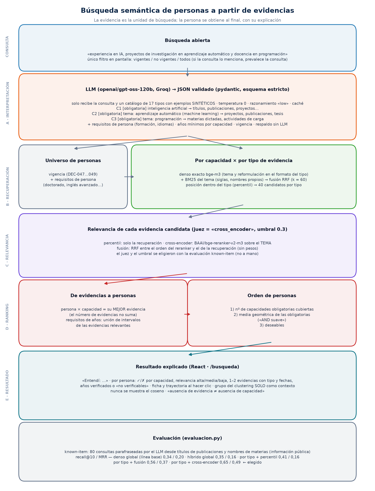

# Búsqueda semántica de personas: lo que se implementó

> 1 de octubre de 2026 · paquete `busqueda` (carpeta `04_busqueda_semantica/`) · vista React
> `/busqueda` · diseño previo y justificación en [DISENO.md](DISENO.md). Los ejemplos muestran
> cargo y unidad, nunca nombres ni identificadores.



*Figura: el proceso completo con los valores actuales (se regenera con `python -m busqueda.diagrama`).*

---

## 1. Qué hace, en una frase

El usuario escribe lo que necesita en lenguaje natural; un LLM separa la consulta en
**capacidades**; cada capacidad se busca **en las evidencias de los tipos donde se acreditaría**;
un modelo de relevancia decide qué evidencias realmente la respaldan; y las **personas** se
ordenan por cuántas capacidades obligatorias cubren y con qué fuerza, mostrando **las evidencias
que lo sustentan**.

## 2. Cómo se usa

| Dónde | Cómo |
|---|---|
| Vista web | Pestaña **Búsqueda** (`http://localhost:5173/busqueda`). Una caja de texto y el filtro *Vigentes / No vigentes / Todos*. Enlace directo: `/busqueda?q=…` |
| API | `POST /api/busqueda` con `{"consulta": "...", "vigencia": "vigentes"}`; `GET /api/busqueda/estado` |
| Python | `from busqueda import buscar; buscar("experiencia en visión artificial")` |
| Consola | `python -m busqueda.buscar "consulta" [--todos | --no-vigentes] [--sin-llm] [--juez cross_encoder|fusion|percentil]` |
| Evaluación | `python -m busqueda.evaluacion --n 40` |
| Diagrama | `python -m busqueda.diagrama` |

Requisitos: `GROQ_API_KEY` en el entorno (sin ella funciona con el respaldo sin LLM), la
instalación editable del proyecto (`python -m pip install -e . --no-deps`, en el entorno global y
en `.venv`) y la librería `groq`.

## 3. El proceso paso a paso

### A · Interpretación de la consulta (`interpretacion.py`)

- **Modelo**: `openai/gpt-oss-120b` en **Groq** (plan gratuito); alterno `openai/gpt-oss-20b`.
- **Qué recibe**: solo la consulta y un catálogo de los 17 tipos de evidencia con un ejemplo
  **sintético** del formato de cada uno. Nunca datos de personas.
- **Qué devuelve** (JSON validado con `pydantic` y esquema estricto de Groq):
  - `capacidades[]`: `descripcion`, **`tema`** (solo el área, sin palabras del tipo de
    actividad), `importancia` (obligatoria / deseable, inferida de "además", "idealmente"…),
    `tipos` de evidencia pertinentes y una `reformulacion` por tipo escrita en el formato real
    de ese tipo;
  - `requisitos_persona`: nivel de formación mínimo e idiomas con nivel;
  - `requisitos_mixtos`: años mínimos para una capacidad;
  - `vigencia`: solo si la consulta la menciona (prevalece sobre el filtro de la vista).
- **Configuración fija**: `temperature = 0`, `reasoning_effort = "low"`, caché por consulta
  (`data/busqueda/cache_interpretaciones.json`).
- **Tolerancia a fallos**: principal (con reintento) → alterno → **respaldo sin LLM** (la
  consulta completa como una capacidad buscada en los 17 tipos). Ante un límite *por minuto* se
  espera lo que indica Groq; si la cuota *diaria* se agotó se pasa directo al alterno.

Ejemplo real (`"quien sepa de contratación pública y haya trabajado en la GTSI"`):

```text
C1 [obligatoria] conocimiento de contratación pública → proyectos, publicaciones, capacitaciones,
                 certificaciones, cargos, contratos, funciones, experiencia externa, carga…
C2 [obligatoria] trabajar en la GTSI → cargos de planta, contratos, funciones, experiencia externa, carga
requisitos: ninguno · vigencia: no especificada (se usa el filtro de la vista)
```

### B · Recuperación por capacidad y por tipo (`indice.py`, `recuperacion.py`)

1. **Universo de personas**: vigencia (reglas DEC-047…049) y requisitos de persona
   (p. ej. *doctorado* deja 246 de 1 363 vigentes).
2. Para cada capacidad y **cada tipo** de evidencia elegido:
   - **denso exacto** con los embeddings `BAAI/bge-m3` ya existentes (87 166 textos × 1 024):
     coseno con el tema y con la reformulación del tipo, se toma el mayor. Producto
     matriz-vector, exacto y reproducible (milisegundos; sin índice aproximado);
   - **léxico**: BM25 propio sobre matrices dispersas (k1 = 1,5; b = 0,75; 42 765 términos;
     3 ms por consulta), sobre el **tema**;
   - **fusión** por rangos (Reciprocal Rank Fusion, `Σ 1/(60 + rango)`, sin pesos);
   - posición dentro del tipo (percentil) y los **40 mejores** por tipo pasan a la etapa C.

### C · Relevancia de cada evidencia candidata (`rerank.py`, `buscar.py`)

- **Juez elegido por la evaluación: cross-encoder** `BAAI/bge-reranker-v2-m3` (multilingüe, sin
  entrenamiento, en GPU, ~0,3 s por 200 pares), que lee juntos **el tema** y el texto de la
  evidencia y da una probabilidad de relevancia.
- **Umbral de "capacidad cubierta" = 0,3**, elegido con la evaluación (§5).
- Alternativas implementadas para comparar: `percentil` (solo recuperación) y `fusion` (RRF
  entre el orden del reranker y el de la recuperación).

### D · De evidencias a personas y ranking (`buscar.py`, `temporal.py`)

- **Puntaje de la persona en cada capacidad = su mejor evidencia.** Tener muchas evidencias
  parecidas no suma (evita favorecer a quien tiene más registros).
- **Requisitos de años**: se toman las evidencias relevantes de esa capacidad, se convierten a
  intervalos (`temporal.py`) y se **unen** (periodos simultáneos no cuentan dos veces). Sin
  fechas suficientes → "no verificable", no "no cumple".
- **Orden**: (1) nº de capacidades obligatorias cubiertas; (2) media geométrica de los puntajes
  de las obligatorias ("AND suave": una capacidad débil arrastra el total); (3) deseables.

Precisión de las fechas por tipo (`temporal.py`):

| Tipos | Precisión |
|---|---|
| Cargos, contratos, funciones, experiencia externa, proyectos, capacitaciones, certificaciones, ponencias | día (fecha de inicio y fin) |
| Materias dictadas | semestre — **aproximación declarada**: 1S = abr–sep, 2S = oct–mar, 0S = ene–mar |
| Actividades de carga, publicaciones | año |
| Títulos, tesis dirigidas | solo fecha de fin (no sirve para duraciones) |
| Menciones | fechas puntuales |
| Idiomas, formación en curso | sin fecha |

Un periodo sin fecha de fin llega hasta hoy solo si la persona es vigente.

### E · Explicación (vista `/busqueda`)

- "**Entendí:**" capacidades (obligatoria/deseable), tipos donde se buscó cada una, requisitos,
  vigencia aplicada, fuente de la interpretación y tiempo.
- Por persona: nombre (leído en vivo), cargo y unidad, ✓/✗ por capacidad, relevancia
  **alta / media / baja** (nunca el coseno), las evidencias que la sustentan con tipo y fechas,
  años verificados, y su grupo del clustering **solo como contexto**. Clic → ficha completa con
  la trayectoria.
- Leyenda fija: *ausencia de evidencia ≠ ausencia de capacidad*.

## 4. Cambios respecto al diseño (y por qué)

| Diseño (DISENO.md) | Implementado | Motivo (con datos) |
|---|---|---|
| Relevancia = percentil dentro del tipo; reranker solo para reordenar el top | **Cross-encoder decide la relevancia de cada evidencia candidata** | Un percentil siempre marca "algo" como relevante; en la evaluación, percentil solo = recall@10 0,41 vs 0,65 con cross-encoder |
| El reranker compara la capacidad con la evidencia | **Compara solo el `tema`** | Con la descripción completa, "proyectos de investigación en aprendizaje automático" puntuaba 0,97 a un proyecto de "aprendizaje **autónomo**" porque coincidían las palabras del tipo; con el tema bajó a 0,08 |
| BM25 y denso sobre la descripción | **Sobre el tema** | Mismo motivo: el tipo ya lo resuelve la búsqueda por tipo |
| Umbral de relevancia "0,5" | **0,3, elegido por evaluación** | La métrica es casi plana entre 0,05 y 0,7; 0,3 deja dentro aciertos claros que el reranker puntúa 0,38–0,5 en títulos cortos |
| Prompt con ejemplos de tema | Ejemplos que **no** coinciden con las consultas de prueba | El modelo copiaba el ejemplo ("programación de software") |
| — | Reglas explícitas en el prompt | "Haber trabajado en la unidad X" es siempre una capacidad aparte; los idiomas van siempre como requisito |

Hipótesis descartadas con prueba: pasar los textos a minúsculas (empeoró el reranker) y
anteponer la etiqueta del tipo al documento (creó falsos positivos).

## 5. Evaluación (`evaluacion.py`)

**Método known-item**: 80 consultas (40 desde títulos de publicaciones y 40 desde nombres de
materias, información pública, de textos que tienen 1–3 personas) parafraseadas por el LLM como
las escribiría alguien que busca a esa persona (p. ej. *"INSTALACIONES INDUSTRIALES"* →
*"Buscamos experto en sistemas de instalaciones industriales"*). Acierto = la persona dueña de la
evidencia aparece en el top-k. Vigencia = todos.

| Variante | R@1 | R@5 | R@10 | MRR | s/consulta* |
|---|---|---|---|---|---|
| A · denso global (línea base, sin LLM) | 0,12 | 0,24 | 0,34 | 0,195 | 0,6 |
| B · híbrido global (denso + BM25, sin LLM) | 0,07 | 0,21 | 0,35 | 0,162 | 0,1 |
| C · LLM + por tipo, juez percentil | 0,04 | 0,31 | 0,41 | 0,156 | 7,7 |
| **D · LLM + por tipo, juez cross-encoder** | **0,41** | **0,59** | **0,65** | **0,493** | 2,2 |
| E · LLM + por tipo, juez fusión | 0,28 | 0,45 | 0,56 | 0,371 | 1,9 |

\* Con modelos cargados e interpretación en caché.

- Por tipo de consulta (R@10 / MRR de D): publicaciones **0,90 / 0,78**; materias **0,40 /
  0,20**. En materias la medida subestima: una consulta como "experto en edición de video" tiene
  muchas personas legítimamente relevantes además de la dueña de la evidencia.
- Grilla de umbrales de D: R@10 entre 0,65 y 0,66 para 0,05–0,7 (consultas de una capacidad, el
  umbral casi no influye). Resultados completos en `data/busqueda/evaluacion/resultados.json`.

## 6. Ejemplos reales (sin nombres)

**"alguien con doctorado y al menos 5 años de experiencia docente en estadística"** →
requisito *formación ≥ doctorado* (246 personas) y *C1: ≥ 5 años*:

```text
1. PROFESOR TITULAR AUXILIAR 2 (TP) · FCNM — 1/1
   ✓ docencia en estadística: relevancia alta · 11,5 años (cumple)
     - [Actividad de carga · 2022] Tutoría académica de proyecto integrador (ESTADÍSTICA), FCNM
     - [Materia dictada · 2009–2011] ESTADÍSTICA, FCNM
2. PROFESOR TITULAR AUXILIAR 1 (MT) · FCNM — 1/1
   ✓ docencia en estadística: relevancia alta · 14,75 años (cumple)
     - [Materia dictada · 1999–2017] ESTADÍSTICA, FCNM
```

**"quien sepa de contratación pública y haya trabajado en la GTSI"** → los primeros cubren 2/2:

```text
1. ANALISTA DE DESARROLLO DE SISTEMAS 3 · GTSI — 2/2
   ✓ conocimiento de contratación pública: alta
     - [Certificación · 2025–actualidad] CERTIFICACIÓN OPERADOR DEL SISTEMA NACIONAL DE CONTRATACIÓN PÚBLICA…
   ✓ trabajar en la GTSI: alta
     - [Cargo de planta · 2015–actualidad] ANALISTA DE DESARROLLO DE SISTEMAS 3, GTSI
3. DIRECTOR DE INGENIERÍA EN SISTEMAS · GTSI — 2/2
   ✓ contratación pública: alta — [Capacitación · 2021] FUNDAMENTOS DE CONTRATACIÓN PÚBLICA…
   ✓ trabajar en la GTSI: alta — [Cargo de planta · 2022–actualidad] DIRECTOR DE INGENIERÍA EN SISTEMAS, GTSI
```

**Consulta del diseño** ("IA + proyectos de investigación en aprendizaje automático + docencia en
programación"): el mejor resultado cubre **2 de 3** y ninguna persona vigente aparece cubriendo
las tres. En ese primer resultado, C1 se sustenta en el diseño de sílabos de *Inteligencia
artificial* (correcto), pero C2 en un proyecto sobre "aprendizaje **autónomo**" (falso positivo
del reranker, 0,48). Es la consulta más difícil del conjunto: la docencia en programación se
acredita con nombres de materias muy cortos que el reranker puntúa bajo. Ver §7.

## 7. Limitaciones conocidas

- **Plan gratuito de Groq**: 8 000 tokens/minuto y 200 000 tokens/día **por modelo**; una
  interpretación usa ~2 900 tokens → ~3 consultas nuevas por minuto y ~68 por día y modelo (las
  repetidas salen de la caché). La evaluación completa consume la cuota diaria del modelo
  principal.
- **El reranker no está calibrado** para títulos cortos en español: el orden es útil, la
  probabilidad absoluta no. Por eso el umbral se eligió por evaluación y debe validarse con
  consultas de varias capacidades.
- **La evaluación automática** mide sobre todo recall de una capacidad y subestima consultas con
  muchas respuestas válidas; **falta la evaluación con expertos** (pooling + juicios 0–2, DISENO §8).
- **Tiempo**: 2,7–5 s por búsqueda con modelos cargados; la primera tras iniciar la API ~30 s
  (carga de modelos); una consulta nueva suma 2–20 s del LLM.
- **Cobertura de datos**: ~374 vigentes no tienen evidencias (brecha de población); las
  personas con pocos registros aparecen menos.
- Duración de materias por semestre aproximada; idiomas y formación en curso sin fechas.

## 8. Archivos

| Archivo | Contenido |
|---|---|
| `comun.py` | Rutas, modelos, parámetros y catálogo de tipos (con los valores elegidos y su justificación) |
| `indice.py` | Carga de embeddings, BM25, tablas de evidencias y personas (nivel de formación, idiomas) |
| `interpretacion.py` | Prompt, esquema, llamada a Groq, caché, reintentos y respaldo |
| `recuperacion.py` | Denso + BM25 + RRF por capacidad y tipo |
| `rerank.py` | Cross-encoder |
| `temporal.py` | Intervalos por tipo y unión de intervalos |
| `buscar.py` | Orquestación, ranking, explicación y CLI |
| `evaluacion.py` | Known-item, ablación y grilla de umbrales |
| `diagrama.py` | Figura del proceso |
| `dashboard_react/backend/main.py` | `POST /api/busqueda`, `GET /api/busqueda/estado` |
| `dashboard_react/frontend/src/pages/BusquedaPage.tsx` | Vista de búsqueda |
| `data/busqueda/` | BM25, caché de interpretaciones, registro de consultas (sin datos de personas), evaluación |

## 9. Librerías y modelos

| Componente | Herramienta | ¿Entrenamiento? |
|---|---|---|
| Embeddings | `BAAI/bge-m3` vía `sentence-transformers` (los de `03_perfiles`) | No |
| Reranker | `BAAI/bge-reranker-v2-m3` vía `sentence-transformers.CrossEncoder` (fp16, GPU) | No |
| LLM | Groq `openai/gpt-oss-120b` (alterno `openai/gpt-oss-20b`), SDK `groq` | No |
| BM25 | Implementación propia con `scipy.sparse` | No |
| Validación | `pydantic` | — |
| API / vista | FastAPI · React + TypeScript + React Query | — |
